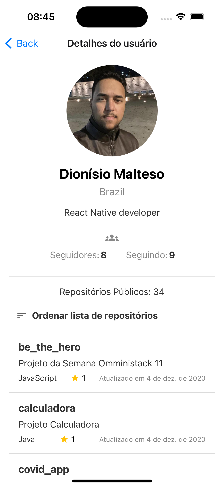

# **Dev Tracker**

## 📖 **About**

This is a **React Native** project designed as a **Dev Tracker** to search and display information about GitHub users. Powered by the [GitHub API](https://docs.github.com/en/rest), the app fetches user details, repositories, and other key data.

## ✨ **Features**

- 🔍 **Search for GitHub users by username.**
- 📄 **View detailed user information:**
  - Followers
  - Following
  - Bio
  - Public repositories
- 📊 **Explore repositories sorted by:**
  - **Name**
  - **Stars (ascending or descending)**
  - **Last updated**
- 🌐 **Open repository details directly on GitHub.**

## 🛠️ **Built With**

This project is powered by the following technologies:

- **React Native 0.76**
- **TypeScript**
- **Redux Toolkit**
- **Axios**
- **React Navigation**
- **Styled Components**
- **React Native Vector Icons**


## 📱 **Screenshots**

| **Lista**               | **Lista de Usuários**          | **Detalhe de Usuários**       |
|--------------------------|-------------------------------|-------------------------------|
|  |  |  |


## 🚀 **Getting Started**

### **Prerequisites**

Make sure you have the following installed on your system:

- [Node.js](https://nodejs.org/)
- [Yarn](https://yarnpkg.com/)
- React Native CLI (`npm install -g react-native-cli`)

### Step 1: Clone the repository
  ```bash
   git clone https://github.com/dionisio28/dev_tracker.git
   cd dev_tracker
   ```
 ### Step 2: Installing the dependencies
  ```bash
   yarn
   ```
   For iOS is necessary an additional Step
   ```bash
   cd ios
   pod install
   ```

### Step 2: Start the Metro Server

Begin by starting **Metro**, the JavaScript bundler that comes with React Native.

```bash
# Using npm
npm start

# OR using Yarn
yarn start
```

### Step 3: Start the Application
With Metro running in one terminal, open a new terminal and run your app.

For Android

```bash
# Using npm
npm run android

# OR using Yarn
yarn android
```

For iOS

```bash
# Using npm
npm run ios

# OR using Yarn
yarn ios
```